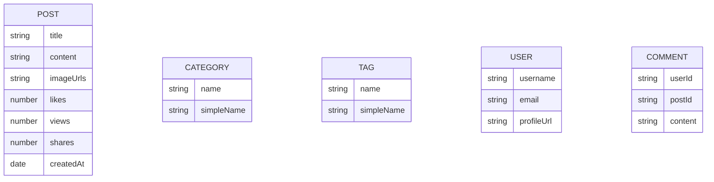

# Tagify

A robust backend CMS(Content Management System)API for a modern blog platform with categories, tags, and advanced filtering. Built with Node.js, Express, and MongoDB.


## Features ✨

### Core Functionalities

- **Post Management**:
  - Create post
  - Get all posts
  - Get posts by their id
  - Update post
  - Delete post
  - View post
  - Like post
  - Dislike post
  - Get posts by respective categories
  - Get posts by respective tags
  - Get User's all posts
  - Search post based on title
  - Get latest posts
  - Get trending posts
  - Get posts by date
  - Get posts by popularity
  - Get posts by views
  - Get posts by likes
  - Get posts by dislikes
  - Get posts by share
- **Category System**: Each post belongs to certain category
  - CRUD operation on categories
- **Tagging Engine**: Flexible many-to-many tagging
  - CRUD operation on tags
- **Comments**: One user can comment on own or other's posts
- CRUD operation on commnets

### Advanced Features

- **Full-text search**
- **Post Analytics Dashboard**
- **Trending tags and categories**
- **MongoDB index optimization**
- **Recommendation engine**
- **User contribution stats**

### Performance Optimizations

- MongoDB indexing for all query patterns
- Lean queries with selective field population
- Aggregation pipelines

## Database Schema



## API Endpoints

- **User**

## Server is live at

- [https://tagify.onrender.com](https://tagify.onrender.com)

## CI/CD

This project includes a GitHub Actions workflow that runs on changes to `ci-cd-project`:

- Installs Node.js dependencies with `npm ci`
- Runs syntax checks with `npm run check`
- Runs smoke tests with `npm test`
- Builds and pushes the production Docker image to Amazon ECR
- Deploys the new image to AWS EC2 using a blue/green container switch behind Nginx

Local verification:

```bash
npm run check
npm test
docker build -t tagify:local .
```

### AWS Deployment

The EC2 deployment uses:

- Amazon ECR for Docker image storage
- EC2 for application runtime
- Nginx as a reverse proxy on port `80`
- Blue/green containers on `127.0.0.1:4001` and `127.0.0.1:4002`

Prepare a new EC2 host:

```bash
sudo APP_USER=ec2-user bash scripts/setup-ec2.sh
```

Required GitHub Actions configuration:

- Repository variables: `AWS_REGION`, `ECR_REPOSITORY`
- Repository secrets: `AWS_ROLE_TO_ASSUME`, `EC2_HOST`, `EC2_USER`, `EC2_SSH_KEY`, `DB_URL`, `JWT_SECRET`

The EC2 instance also needs permission to pull from ECR. Attach an IAM role with ECR read access, or provide equivalent AWS credentials on the instance.

### AWS Infrastructure Provisioning

You can provision the base AWS resources with the AWS CLI helper:

```bash
AWS_REGION=us-east-1 \
APP_NAME=tagify \
VPC_ID=vpc-xxxxxxxx \
SUBNET_ID=subnet-xxxxxxxx \
KEY_NAME=your-key-pair \
SSH_CIDR=x.x.x.x/32 \
bash scripts/provision-aws.sh
```

The script creates or reuses:

- Amazon ECR repository
- IAM role and EC2 instance profile with ECR pull and CloudWatch write permissions
- Security group with SSH and HTTP access
- EC2 instance tagged for this project

### Monitoring and Logging

`scripts/setup-ec2.sh` installs and configures the CloudWatch Agent. It publishes:

- Nginx access logs to `/tagify/nginx/access`
- Nginx error logs to `/tagify/nginx/error`
- Deployment logs to `/tagify/deploy`
- CPU, memory, and disk utilization metrics

## License

This project is licensed under the MIT License - see the [LICENSE](./LICENSE) file for details.
